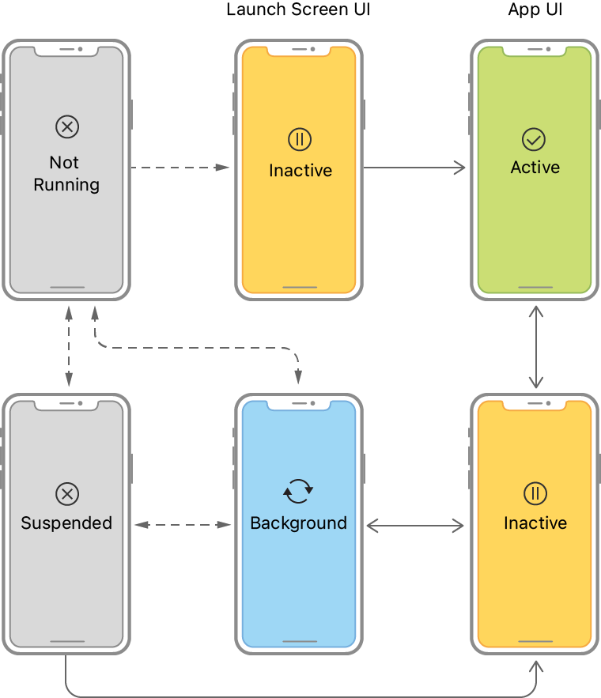

# iOS Life Cycle

- 앱이 시작되고 실행되며, 종료되는 과정이다.
- 일련의 상태와 이벤트로 구성되어 있다.
- UIKit 프레임워크나 SwiftUI 를 사용하는 App 은 App Life Cycle 과 View Life Cycle 로 나뉜다.

1. **App Life Cycle**
2. **Scene Life Cycle**
<!-- 3. **View Controller Life Cycle** -->

 
 
 

## 앱 라이프 사이클 (App Life Cycle)

### 앱 시작 (Launching)

1. **Cold Start / Warm Start**: 앱이 메모리에 전혀 없는 상태에서 시작되는 것을 Cold Start라고 하며, 이미 메모리에 로드되어 있을 때 시작되는 것을 Warm Start라고 합니다.

2. **Main 함수**: 
    1. `main` 함수 실행
        - 앱의 실행이 시작되면 가장 먼저 `main` 함수가 호출됩니다. 이 함수는 앱의 진입점(entry point)입니다.
        
    2. `UIApplicationMain` 함수 호출
        - `main` 함수 내에서 `UIApplicationMain` 함수가 호출됩니다. 이 함수는 앱의 주 실행 루프와 기타 앱 수준의 리소스를 설정합니다.
    3. `UIApplication` 객체 생성
        - `UIApplicationMain` 함수는 `UIApplication` 객체를 생성합니다. 이 객체는 앱의 이벤트 루프와 기타 앱 수준의 동작을 관리합니다.
    4. nib 파일 및 Info.plist 파일 로딩
        - `UIApplication` 객체는 `Info.plist` 파일에서 앱의 설정 정보를 읽어들입니다. 또한, 스토리보드나 nib 파일이 있다면 이 파일들도 이 시점에서 로드됩니다.
    5. App Delegate 객체 생성 및 설정
        - `UIApplication` 객체는 `AppDelegate` 객체를 생성하고 설정합니다. `AppDelegate`는 앱의 라이프 사이클 이벤트를 관리하며, `UIApplication` 객체와 연결됩니다. 이 단계에서 런루프(RunLoop)도 생성됩니다.
  
     

3. **Launch Screen**: 앱이 시작될 때 보이는 초기 스크린. 이는 앱이 로드되고 초기화되는 동안 표시됩니다.
4. **Application Delegate**: 앱이 시작되면 시스템은 `AppDelegate` 클래스의 `application:willFinishLaunchingWithOptions:` 및 `application:didFinishLaunchingWithOptions:` 메서드를 호출합니다. 이 단계에서 앱은 초기 설정을 수행합니다.

### 앱 실행 (Running)

1. **Main Run Loop**: 앱이 시작되면 메인 실행 루프가 동작을 시작합니다. 이 루프는 사용자의 입력, 터치 이벤트, 시스템 이벤트 등을 처리합니다.
2. **Event Handling**: 사용자가 버튼을 누르거나 화면을 터치하는 등의 이벤트가 발생하면 이를 처리하는 메서드나 함수가 호출됩니다.
3. **View Controller Life Cycle**: 사용자가 앱 내의 다양한 뷰를 탐색하면 뷰 컨트롤러의 라이프 사이클 메서드(`viewDidLoad`, `viewWillAppear` 등)가 호출됩니다.
4. **Backgrounding**: 사용자가 홈 버튼을 누르거나 다른 앱을 시작하면, 앱은 백그라운드 상태로 전환됩니다. `applicationDidEnterBackground:` 메서드가 호출되며, 필요한 경우 백그라운드 작업을 수행합니다.

### 앱 종료 (Termination)

1. **User-Initiated Termination**: 사용자가 앱 스위처를 사용하여 앱을 종료할 수 있습니다.
2. **System-Initiated Termination**: 시스템 리소스가 부족한 경우, 시스템은 백그라운드에 있는 앱을 종료할 수 있습니다. 이때 `applicationWillTerminate:` 메서드가 호출됩니다.
3. **Explicit Termination**: 앱이 예외 상황을 만나서 명시적으로 종료되거나 크래시가 발생할 수도 있습니다.
4. **Suspended State**: 앱이 백그라운드에서 아무런 작업도 하지 않는 상태로 들어가면 Suspended 상태가 됩니다. 이 상태에서도 언제든지 시스템에 의해 종료될 수 있습니다.

### 주요 상태 (States)

1. **Not Running**: 앱이 아직 실행되지 않았거나 시스템에 의해 종료된 상태
2. **Inactive**: 앱이 실행 중이지만 아무런 이벤트를 받고 있지 않은 상태
3. **Active**: 앱이 실행 중이며 이벤트를 받고 있는 상태
4. **Background**: 앱이 백그라운드로 들어간 상태
5. **Suspended**: 앱이 백그라운드에 있지만 코드를 실행하지 않는 상태

### 주요 메서드 (AppDelegate)

- `application:willFinishLaunchingWithOptions:`: 앱이 처음 시작될 때 호출
- `application:didFinishLaunchingWithOptions:`: 앱이 로딩 완료된 직후 호출
- `applicationDidBecomeActive:`: 앱이 Active 상태로 전환될 때 호출
- `applicationWillResignActive:`: 앱이 Inactive 상태로 전환될 때 호출
- `applicationDidEnterBackground:`: 앱이 Background 상태로 전환될 때 호출
- `applicationWillEnterForeground:`: 앱이 Background에서 Active로 전환되기 직전에 호출
- `applicationWillTerminate:`: 앱이 종료되기 직전에 호출

 
 
 

## 씬 라이프 사이클 (Scene Life Cycle)

### Scene 시작 (Scene Initialization)
  
1. **Instantiation**: Scene 인스턴스가 앱에 처음 생성될 때 `scene(_:willConnectTo:options:)` 메서드가 호출됩니다.
2. **Configuration**: Scene의 설정 정보를 준비하거나 변경합니다.
3. **Activation**: Scene이 사용자에게 보여지기 직전에, `sceneWillEnterForeground:`와 `sceneDidBecomeActive:` 메서드가 호출됩니다.

### Scene 실행 (Scene Execution)

1. **Will Appear**: Scene이 화면에 표시되기 직전에 `sceneWillEnterForeground:` 메서드가 호출됩니다.
2. **Did Appear**: Scene이 화면에 완전히 표시된 후에 `sceneDidBecomeActive:` 메서드가 호출됩니다.
3. **Event Handling and Subviews Layout**: Scene이 Active 상태에 있을 때 사용자 입력과 같은 이벤트를 처리합니다.

### Scene 종료 (Scene Termination)

1. **Will Disappear**: Scene이 화면에서 사라지기 전에 `sceneWillResignActive:`와 `sceneWillEnterBackground:` 메서드가 호출됩니다.
2. **Did Disappear**: Scene이 화면에서 완전히 사라진 후에 `sceneDidDisconnect:` 메서드가 호출됩니다.
3. **Deinitialization**: 필요한 정리 작업을 수행합니다.

### 주요 상태 (States)
1. **Unattached**: Scene 객체가 생성되었지만 아직 UIWindow나 다른 리소스와 연결되지 않은 상태.
2. **Foreground Active**: Scene이 활성화되고 사용자와 상호작용을 하고 있는 상태.
3. **Foreground Inactive**: Scene이 포그라운드에 있지만 현재 사용자와 상호작용을 하지 않고 있는 상태.
4. **Background**: Scene이 백그라운드에 있지만 코드를 실행할 수 있는 상태.
5. **Suspended**: Scene이 백그라운드에 있고 현재 코드를 실행하고 있지 않는 상태.

### 주요 메서드 (UISceneDelegate)
- `scene(_:willConnectTo:options:)`: Scene 인스턴스가 앱에 생성될 때 호출. (Unattached → Foreground Inactive 또는 Background)
- `sceneDidDisconnect:`: Scene이 메모리에서 제거되기 직전에 호출.
- `sceneDidBecomeActive:`: Scene이 활성화되어 사용자와 상호작용을 시작할 때 호출. (Foreground Inactive → Foreground Active)
- `sceneWillResignActive:`: Scene이 비활성화되어 사용자와 상호작용을 중지할 때 호출. (Foreground Active → Foreground Inactive)
- `sceneWillEnterForeground:`: Scene이 백그라운드에서 포그라운드로 전환될 때 호출. (Background → Foreground Inactive)
- `sceneDidEnterBackground:`: Scene이 포그라운드에서 백그라운드로 전환될 때 호출. (Foreground Inactive → Background)

 
 
 

<!-- ## 뷰 컨트롤러 라이프 사이클 (View Controller Life Cycle) 

### 뷰 시작 (View Initialization)

1. **Instantiation**: 스토리보드, XIB 또는 코드를 사용하여 뷰 컨트롤러가 인스턴스화됩니다.
2. **Initialization**: `init` 메서드를 통해 뷰 컨트롤러가 초기화됩니다.
3. **Loading**: `loadView` 메서드가 호출되어 뷰 계층을 로드합니다. 이 후에 `viewDidLoad` 메서드가 호출됩니다.

### 뷰 실행 (View Presentation)

1. **Will Appear**: 뷰가 화면에 표시되기 전에 `viewWillAppear:` 메서드가 호출됩니다.
2. **Did Appear**: 뷰가 화면에 완전히 표시된 후에 `viewDidAppear:` 메서드가 호출됩니다.
3. **Layout Subviews**: 뷰의 `layoutSubviews` 메서드가 호출되며, 이곳에서 서브뷰들의 레이아웃을 조정합니다.

### 뷰 종료 (View Dismissal)

1. **Will Disappear**: 뷰가 화면에서 사라지기 전에 `viewWillDisappear:` 메서드가 호출됩니다.
2. **Did Disappear**: 뷰가 화면에서 완전히 사라진 후에 `viewDidDisappear:` 메서드가 호출됩니다.
3. **Deinitialization**: 뷰 컨트롤러의 `deinit` 메서드가 호출되어 필요한 정리 작업을 수행합니다.

### 주요 단계 (States)

1. **Initialization**: 뷰가 생성되는 상태
2. **Loading**: 뷰가 로딩되는 상태
3. **Appearing**: 뷰가 보여지는 상태
4. **Laid Out Subviews**: 뷰가 서브뷰와 함께 레이아웃되는 상태
5. **Disappearing**: 뷰가 사라지는 상태
6. **Deinitialization**: 뷰가 메모리에서 해제되는 상태 -->